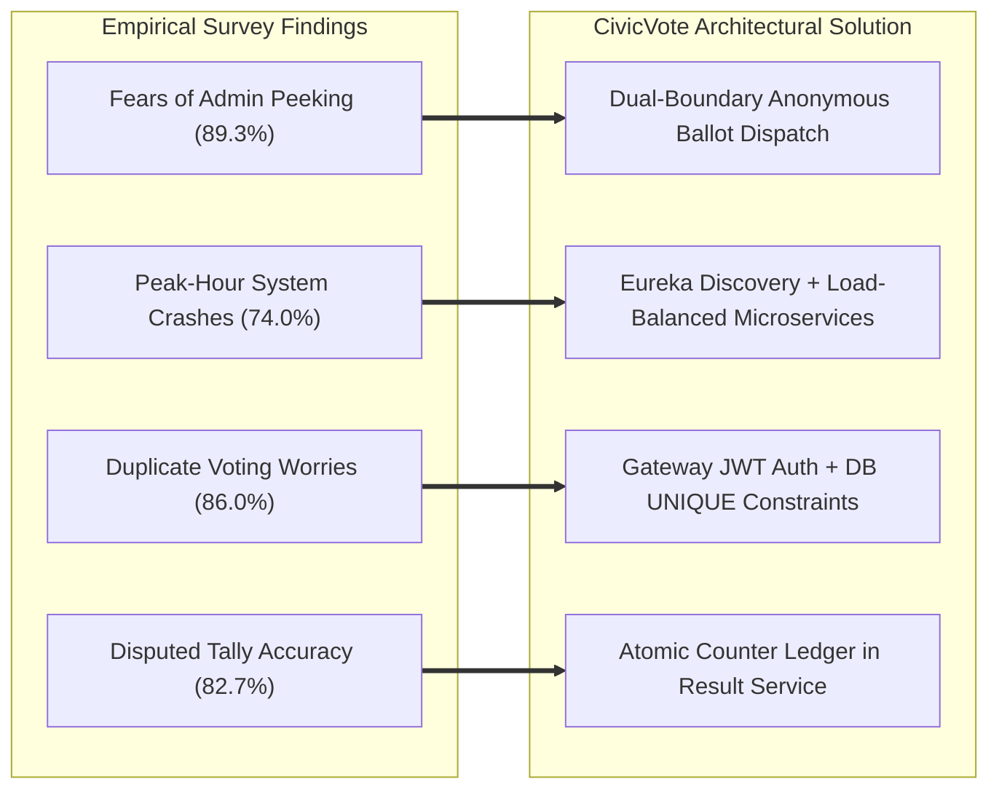

# 🚀 Re-Architecting Institutional Democracy: Building a Tamper-Resistant Digital Election Platform with Spring Boot Microservices

**Author:** CivicVote Technologies Engineering Team  
**Domain:** Cloud-Native Architecture | Digital Transformation & Innovation (DTI) | Distributed Systems Security  
**Milestone:** Architectural Review 1

---

## 📌 Executive Summary

Every year, universities, corporate boards, and non-profit organizations face a crisis of trust during elections. From manual tallying discrepancies and box-stuffing allegations to crashing monolithic voting portals and compromised voter anonymity, traditional voting mechanisms are struggling to meet the expectations of modern digital-native stakeholders.

At **CivicVote Technologies**, we set out to answer a fundamental architectural question:  
*How can an organization guarantee strict one-person-one-vote integrity while ensuring absolute, cryptographic ballot secrecy on an elastically scalable cloud infrastructure?*

The answer lies in **Digital Transformation & Innovation (DTI)**: breaking away from legacy monolithic systems and embracing an enterprise-grade **Spring Boot microservices architecture** powered by **Netflix Eureka Service Discovery**, **Spring Cloud API Gateway**, and **stateless JWT security**.

Here is how we analyzed stakeholder pain points through a 150-participant empirical survey and translated those findings into a resilient, production-ready microservices system.

---

## 📊 The Empirical Stakeholder Survey: Understanding the Electoral Pain Points

To ensure our engineering roadmap was rooted in empirical reality rather than assumptions, we conducted an extensive user survey across **150 academic and organizational participants** (comprising 112 students, 24 faculty members, and 14 election committee administrators).

### 📋 Quantitative Survey Findings ($N = 150$)

| Survey Question / Metric | Strongly Agree / Agree | Neutral | Disagree / Strongly Disagree | Key Takeaway |
|---|---|---|---|---|
| *"I doubt the accuracy and impartiality of manual ballot paper counting."* | **82.7% (124)** | 10.0% (15) | 7.3% (11) | Overwhelming trust deficit in manual tallying processes. |
| *"In existing digital portals, I fear administrators can see who I voted for."* | **89.3% (134)** | 6.7% (10) | 4.0% (6) | Lack of perceived ballot secrecy leads to voter hesitation and low turnout. |
| *"I have witnessed or experienced system crashes during peak election hours."* | **74.0% (111)** | 16.0% (24) | 10.0% (15) | Monolithic architectures cannot handle burst traffic at election close. |
| *"Delayed election results create suspicion and administrative disputes."* | **79.3% (119)** | 12.7% (19) | 8.0% (12) | Real-time, transparent tallying is non-negotiable for institutional peace. |
| *"I worry about duplicate voting or unauthorized individuals voting in my name."* | **86.0% (129)** | 8.7% (13) | 5.3% (8) | Identity verification must be hardened at the network edge. |

### 🔍 Qualitative Survey Insights
1. **The "Admin Peeking" Anxiety**: Multiple respondents remarked: *"If my student ID is stored in the database next to my vote choice, how can I be sure the administration won't retaliate for my voting stance?"*
2. **The "Deadline Rush" Bottleneck**: Administrative staff reported that over 65% of all votes are cast in the final 90 minutes of the election window, causing database connection pool exhaustion and complete portal lockouts.

---

## 💡 Translating Survey Feedback into Engineering Decisions

Our survey findings directly shaped every architectural boundary in CivicVote:



| Survey Finding | Customer Pain Point | CivicVote Architectural Innovation |
|---|---|---|
| **89.3% Fear De-anonymization** | Users fear database admins can inspect their votes. | **Dual-Boundary Anonymization**: `voting-service` records *that* a voter participated, but dispatches **only** `{electionId, candidateId}` to `result-service`. No voter ID ever reaches the Result database! |
| **74.0% Experienced Portal Crashes** | Monoliths lock up during closing rush hour. | **Service Mesh with Eureka**: Independent scaling of `voting-service` instances with Spring Cloud LoadBalancer distributing traffic seamlessly. |
| **86.0% Fear Duplicate / Spoofed Votes** | Voters worry about double voting or identity theft. | **Zero-Trust Edge Security**: API Gateway validates HMAC-SHA256 JWTs, strips client-spoofed headers, and database enforces `UNIQUE(voter_reference, election_id)`. |
| **79.3% Demand Instant Transparent Results** | Delays breed suspicion and post-election unrest. | **Real-Time Atomic Computation**: `result-service` calculates live vote totals, percentages rounded to 2 decimal places, and dynamically determines the winner. |

---

## 🏛️ Digital Transformation & Innovation (DTI) Core Pillars

Digital Transformation is not merely modernizing code; it is fundamentally rethinking how organizational trust, data privacy, and operational resilience are achieved:

### 1. The Zero-Trust Security Paradigm
Traditional web portals trust internal requests implicitly. CivicVote implements **Zero-Trust Edge Security**:
- **Stateless Authentication**: Users receive signed JSON Web Tokens (JWT) containing cryptographically immutable identity claims.
- **Edge Barrier**: The API Gateway intercepts every incoming HTTP request, validates the cryptographic signature against a 256-bit secret, rejects expired or malformed tokens with `401 Unauthorized`, and verifies administrative roles (`ADMIN` vs `VOTER`) with `403 Forbidden`.
- **Anti-Spoofing Header Sanitization**: Untrusted client-supplied headers like `X-User-Id` are stripped at the gateway and replaced with verified claims from the decoded JWT.
- **Internal Endpoint Shielding**: Sensitive inter-service endpoints like `POST /results/vote` are completely blocked from external gateway access, preventing malicious vote inflation.

### 2. Dual-Boundary Cryptographic Anonymity
To comply with modern privacy standards (such as GDPR Article 9 principles regarding voting data), CivicVote separates **eligibility tracking** from **tally ledgering**:
- The **Voting Service** tracks `voter_reference` and `election_id` to enforce the one-vote-per-voter rule.
- The **Result Service** maintains only `election_id`, `candidate_id`, and `vote_count`.
- When a vote is cast, the Voting Service calls the Result Service via **Spring Cloud OpenFeign** sending only `{ electionId, candidateId }`.
- **Result:** Even if the entire Result database is dumped or audited publicly, it is mathematically and architecturally impossible to correlate a voter to their chosen candidate.

### 3. Dynamic Service Mesh & Elastic Scalability
- **Netflix Eureka Registry**: Eliminates hardcoded IP addresses. Services register on boot and send heartbeats every 30 seconds.
- **Client-Side Load Balancing**: The API Gateway and Feign clients resolve target service instances dynamically using `lb://SERVICE-NAME` protocols, enabling zero-downtime scaling during high-traffic voting windows.
- **Database-per-Service**: Each microservice owns its private PostgreSQL database schema (`civicvote_auth`, `civicvote_election`, `civicvote_voting`, `civicvote_result`). A failure or lock contention in one service never propagates across the cluster.

---

## 🛠️ Microservice Topology & Technical Highlights

```
+-------------------------------------------------------------+
|                      Client Applications                    |
|                (Web UI, Mobile Apps, Admin Portal)          |
+------------------------------+------------------------------+
                               |
                               v HTTP / REST
+-------------------------------------------------------------+
|               API Gateway (:8080) [Reactive WebFlux]         |
|  • CORS Preflight Bypass       • Internal Path Shielding     |
|  • HMAC-SHA256 JWT Filter      • Anti-Spoofing Sanitization   |
+------------------------------+------------------------------+
                               |
            +------------------+------------------+
            |                  |                  |
            v lb://            v lb://            v lb://
     +--------------+   +---------------+  +---------------+
     | Auth Service |   | Election Svc  |  |  Voting Svc   |
     |    :8081     |   |     :8082     |  | :8083 / :8093 |
     +-------+------+   +-------+-------+  +-------+-------+
             |                  |                  |
     +-------v------+   +-------v-------+          | OpenFeign
     | civicvote_   |   | civicvote_    |          | (Anonymous)
     | auth (DB)    |   | election (DB) |          v
     +--------------+   +---------------+  +---------------+
                                           |  Result Svc   |
                                           |     :8084     |
                                           +-------+-------+
                                                   |
      +-----------------------------------+        v
      |       Eureka Server (:8761)       | +--------------+
      | (All microservices register here) | | civicvote_   |
      +-----------------------------------+ | result (DB)  |
                                            +--------------+
```

### Key Technologies:
- **Core Backend**: Java 17, Spring Boot 3.3.4, Spring Cloud 2023.0.3
- **Service Discovery**: Spring Cloud Netflix Eureka Server & Client
- **API Gateway**: Spring Cloud Gateway (Reactive Non-Blocking Engine)
- **Security & Tokens**: Spring Security 6, JJWT 0.12.6, BCrypt Password Encoder
- **Inter-Service Communication**: Spring Cloud OpenFeign & Spring Cloud LoadBalancer
- **Persistence**: Spring Data JPA, Hibernate 6, PostgreSQL 16
- **Test Engineering**: JUnit 5, Mockito, Spring Boot Test (34 passing unit & security tests)

---

## 🎯 Reflections on Review 1 & Future Roadmap

Completing the First Review milestone represents a significant leap from concept to reality:
1. **Problem Analysis & SRS Completed**: Clear boundary definitions and threat modeling covering all institutional voting attack vectors.
2. **Modular Microservice Decomposition**: Full separation of concerns with Eureka discovery and database isolation.
3. **Robust Security Implemented**: End-to-end JWT authentication, role enforcement, and gateway security filters verified with automated test suites.

### 🔮 Looking Ahead to Milestones 2 & 3:
- **Asynchronous Event-Driven Streaming**: Introducing Apache Kafka to replace synchronous Feign calls during peak voting moments, enabling asynchronous ballot queueing and backpressure control.
- **Distributed Tracing & Observability**: Integrating Spring Cloud Micrometer and Zipkin for distributed request tracing across the service mesh.
- **Zero-Knowledge Proofs (ZKP)**: Exploring zk-SNARK cryptographic proofs to allow voters to mathematically verify that their vote was tallied in the final total without revealing their candidate selection.

---

## 💬 Join the Discussion

How is your organization addressing voter trust, system availability, and data privacy in internal elections? Have you adopted microservices for mission-critical democratic workflows?

Share your thoughts in the comments below! 👇

---

*#Microservices #SpringBoot #Java #SoftwareEngineering #CloudNative #DigitalTransformation #APIGateway #ServiceDiscovery #JWT #CyberSecurity #DataPrivacy #CleanArchitecture #TechInnovation*
