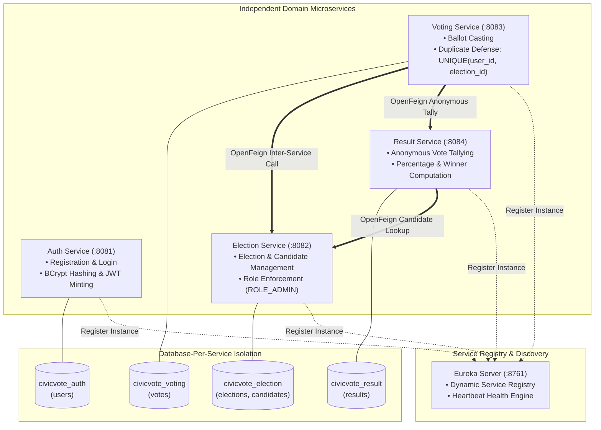

# Microservice Architecture & Service Discovery Specification

## CivicVote Technologies — Decoupled Microservices Architecture

---

## 1. Architecture Overview

The CivicVote platform adheres to microservices principles, decomposing the election lifecycle into discrete services with strict encapsulation, explicit REST contracts, and isolated PostgreSQL databases. All services register dynamically with **Netflix Eureka** for service discovery.



---

## 2. Microservice Identification & Responsibilities

| Microservice | Port | Primary Responsibilities | Data Ownership | Inter-Service Dependencies |
|---|---|---|---|---|
| `eureka-server` | 8761 | Service registry, instance heartbeats, discovery metadata | In-memory registry cache | None (infrastructure backbone) |
| `auth-service` | 8081 | User registration, login, BCrypt password hashing, JWT generation | `civicvote_auth` (`users`) | None |
| `election-service` | 8082 | Election CRUD, candidate slate management, dynamic election status | `civicvote_election` (`elections`, `candidates`) | None |
| `voting-service` | 8083 | Ballot casting, duplicate vote prevention (`UNIQUE(user_id, election_id)`) | `civicvote_voting` (`votes`) | `election-service`, `result-service` |
| `result-service` | 8084 | Anonymous vote counting, tallying, winner computation | `civicvote_result` (`results`) | `election-service` |

---

## 3. Service Discovery via Eureka

* **Dynamic Lookup**: When `voting-service` needs to validate election status or record a tally, it resolves the network address of `ELECTION-SERVICE` and `RESULT-SERVICE` dynamically from Eureka.
* **No Hardcoded URLs**: Inter-service Feign clients use service names:
  ```java
  @FeignClient(name = "ELECTION-SERVICE")
  public interface ElectionServiceClient { ... }

  @FeignClient(name = "RESULT-SERVICE")
  public interface ResultServiceClient { ... }
  ```
* **Resilience**: Heartbeats ensure dead instances are de-registered automatically.

---

## 4. Security & JWT Validation Architecture

1. **Token Minting**: `auth-service` issues HMAC-SHA256 tokens upon valid login. The token contains `userId`, `username`, `role`, and `expiration`.
2. **Decentralized Verification**: Each microservice (`election-service`, `voting-service`, `result-service`) contains its own `JwtUtil` and Spring Security `JwtAuthenticationFilter`.
3. **Role Enforcement**:
   * Admin routes (`POST /elections`, `POST /elections/{id}/candidates`) enforce `hasRole('ADMIN')`. Non-admins receive `403 Forbidden`.
   * Unauthenticated calls receive `401 Unauthorized`.
4. **Tamper Resistance**: The `VotingController` reads the authenticated user's identity from the Spring Security context (`Authentication`), making it impossible for a client to spoof a voter ID.
