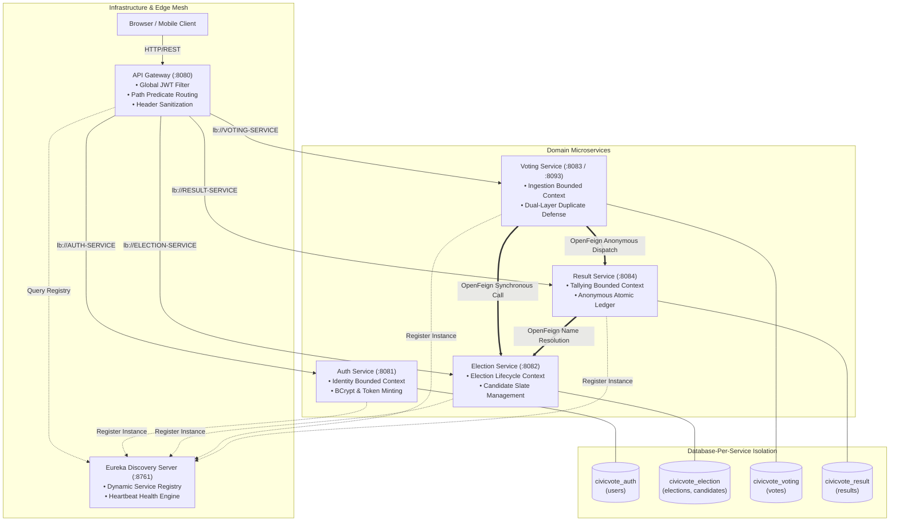
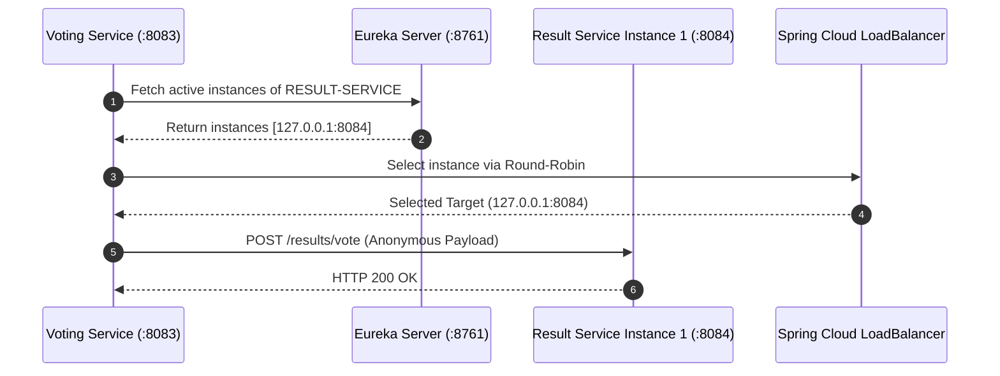

# Microservice Architecture & Service Discovery Specification
## CivicVote Technologies — Highly Modular Cloud-Native Architecture

---

## 1. Domain-Driven Design (DDD) & Modular Decomposition

The CivicVote platform adheres to **Domain-Driven Design (DDD)** principles, decomposing the voting lifecycle into discrete **Bounded Contexts** with strict encapsulation, explicit interfaces, and isolated persistence stores.



---

## 2. Microservice Identification & Bounded Contexts

| Bounded Context | Microservice | Primary Responsibilities | Data Ownership | Inter-Service Dependencies |
|-----------------|--------------|--------------------------|----------------|----------------------------|
| **Service Discovery** | `eureka-server` | Dynamic registry, instance heartbeats, discovery metadata | In-memory registry cache | None (infrastructure backbone) |
| **Edge & Routing** | `api-gateway` | Single entry point, JWT verification, role routing, header sanitization | Stateless | Queries Eureka for dynamic instance discovery |
| **Identity & Access** | `auth-service` | User onboarding, credential verification, BCrypt hashing, JWT generation & introspection | `civicvote_auth` (`users`) | None |
| **Election Management**| `election-service` | Election scheduling, temporal status evaluation, candidate nomination | `civicvote_election` (`elections`, `candidates`) | None |
| **Ballot Ingestion** | `voting-service` | One-vote-per-user enforcement, candidate validation, anonymous ballot forwarding | `civicvote_voting` (`votes`) | Calls `election-service` (status/candidate checks), Calls `result-service` (records vote) |
| **Result Aggregation**| `result-service` | Atomic vote tallying, percentage computation, winner determination | `civicvote_result` (`results`) | Calls `election-service` (candidate name resolution) |

---

## 3. Service Discovery Engine: Netflix Eureka Architecture

### 3.1 Registry & Heartbeat Mechanism
- **Self-Registration**: Every microservice boots with `spring-cloud-starter-netflix-eureka-client`, transmitting its network coordinates (`IP`, `port`, `service-name`) to `http://localhost:8761/eureka/`.
- **Heartbeat & Liveness**: Clients transmit a periodic heartbeat every **30 seconds** (`eureka.instance.lease-renewal-interval-in-seconds: 30`).
- **Eviction Threshold**: If an instance misses heartbeats for **90 seconds** (`eureka.instance.lease-expiration-duration-in-seconds: 90`), the Eureka Server drops it from the active registry.
- **Client-Side Cache**: Microservices cache registry snapshots locally, enabling resilient routing even during temporary Eureka downtime.

### 3.2 Service Discovery Flow


---

## 4. Declarative Inter-Service Communication (Spring Cloud OpenFeign)

Microservices communicate across boundaries using **Spring Cloud OpenFeign**, providing type-safe, declarative REST clients with integrated load balancing.

### 4.1 Voting Service Feign Clients

```java
@FeignClient(name = "ELECTION-SERVICE")
public interface ElectionServiceClient {
    @GetMapping("/elections/{id}/status")
    Map<String, Object> getElectionStatus(@PathVariable("id") Long id);

    @GetMapping("/elections/{id}/candidates")
    List<Map<String, Object>> getCandidates(@PathVariable("id") Long id);
}

@FeignClient(name = "RESULT-SERVICE")
public interface ResultServiceClient {
    @PostMapping("/results/vote")
    void recordVote(@RequestBody Map<String, Long> voteData);
}
```

### 4.2 Result Service Feign Client

```java
@FeignClient(name = "ELECTION-SERVICE")
public interface ElectionServiceClient {
    @GetMapping("/elections/{id}/candidates")
    List<Map<String, Object>> getCandidates(@PathVariable("id") Long id);
}
```

---

## 5. Architectural Hallmarks of Level 4 Modularity

1. **Strict Database-Per-Service Pattern**:
   - Services never perform cross-database SQL joins.
   - All entity lookups across boundaries occur strictly through OpenFeign REST contracts.
   - If `civicvote_voting` is subjected to database maintenance, `civicvote_auth` and `civicvote_election` remain completely operational.
2. **Anonymous Ballot Decoupling (Dual-Boundary Isolation)**:
   - `voting-service` stores `voter_reference` and `election_id` to enforce the one-vote-per-user rule.
   - It forwards **strictly** `{ electionId, candidateId }` to `result-service`.
   - `result-service` has **no conceptual or relational schema** for voter identities, making ballot deanonymization impossible even under compromised database access.
3. **Dynamic Elastic Scalability**:
   - The system is architected so read-heavy services (`result-service`) and burst-heavy services (`voting-service`) scale horizontally independently.
   - Spring Cloud LoadBalancer distributes traffic evenly across multiple instances.
4. **Resilient Failure Blast-Radius Containment**:
   - Failure of the `result-service` triggers a clean exception flow without corrupting voter credential records or election schedules.
