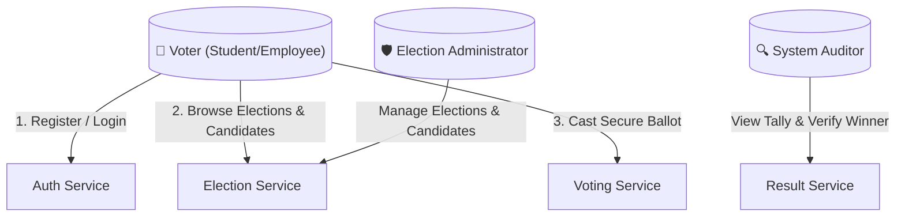
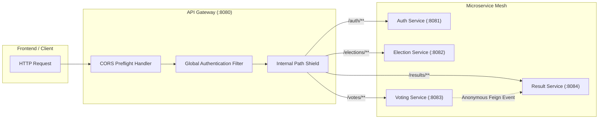

# Software Requirements Specification (SRS) — CivicVote Technologies
## Tamper-Resistant Digital Election & Vote Auditing System

---

## 1. Executive Summary & Vision

**CivicVote Technologies** provides a tamper-resistant, fault-tolerant, and cryptographically verifiable digital election platform tailored for universities, corporate governance boards, and member organizations. The system decouples voter authentication from ballot casting through a microservices architecture, guaranteeing **strict one-person-one-vote integrity** alongside **zero-knowledge ballot anonymity**.

---

## 2. In-Depth Problem Analysis & Threat Modeling

### 2.1 The Crisis of Traditional & Monolithic Institutional Voting
Traditional voting workflows in universities and enterprises suffer from severe structural vulnerabilities:
1. **Paper-Based Inefficiencies & Tampering**: Physical ballots risk box-stuffing, misplacement, subjective invalidation, and laborious manual counting prone to human error and disputes.
2. **Centralized Monolithic Voting Web Portals**:
   - Single Point of Failure (SPOF): High concurrency during election closing hours crashes monolithic backends.
   - Shared Database Vulnerability: Monolithic schemas typically store the voter's user record in the same relational table or joinable structure as their cast vote (`User_Votes(user_id, candidate_id)`), allowing corrupt database administrators or compromised services to deanonymize voter choices.
   - Lack of Cryptographic Verification: Tokens are often stored in server-side sessions; token hijacking allows unauthorized ballot casting.

### 2.2 STRIDE Threat Model for CivicVote

| Threat Category | Specific Electoral Risk | CivicVote Architectural Mitigation |
|-----------------|-------------------------|------------------------------------|
| **S**poofing | Attacker masquerades as a legitimate voter or administrator | Asymmetric/HMAC-SHA256 signed stateless JWT with BCrypt password hashing (cost 10). Role claims embedded and verified at API Gateway. |
| **T**ampering | Malicious actor inflates candidate tallies directly | Dual-boundary architecture: direct access to `POST /results/vote` is blocked at API Gateway; only the internal `voting-service` can dispatch anonymous tallies via Eureka service mesh. |
| **R**epudiation | Disputed vote submissions or double-voting claims | Hashed voter reference stored in `voting-service` with PostgreSQL `UNIQUE(voter_reference, election_id)` constraint prevents multi-casting while isolating identity from results. |
| **I**nformation Disclosure | Administrators or eavesdroppers viewing who voted for whom | Ballot Anonymization: `voting-service` sends **only** `{electionId, candidateId}` to `result-service` via OpenFeign. No voter reference or user ID crosses into the Result database. |
| **D**enial of Service | High voter turnout overwhelming the voting endpoint | Independent scaling of `voting-service` instances registered under Eureka service discovery, fronted by Spring Cloud LoadBalancer round-robin distribution. |
| **E**levation of Privilege | Standard voter executing administrative candidate or election mutations | Gateway-level role-based route enforcement rejecting non-`ADMIN` requests on `/elections/**` with `403 Forbidden`. |

---

## 3. Stakeholder Profiles & Personas

### Stakeholder Roles
1. **Voter**: Authenticates securely, inspects active elections, reviews candidate profiles, casts exactly one anonymous ballot per election, and verifies that their ballot status is recorded.
2. **Election Administrator**: Creates and schedules elections (dates, descriptions), configures candidate slates, updates election lifecycle, and oversees participation metrics. Strictly blocked from inspecting individual ballot links.
3. **Auditor / Observer**: Inspects live and finalized vote tallies, percentage breakdowns, and winner determinations without administrative mutation rights.

---

## 4. Comprehensive Functional Requirements

### Functional Requirements Specification

#### FR-01: User Registration
- **Actor**: Public User / Voter / Admin
- **Pre-conditions**: Valid email format, unique username, password $\ge 6$ characters.
- **Main Flow**: Client submits `POST /auth/register` $\rightarrow$ Auth Service verifies email/username uniqueness $\rightarrow$ BCrypt hashes password $\rightarrow$ User record created in `civicvote_auth` $\rightarrow$ JWT issued containing `userId`, `username`, `role`.
- **Post-conditions**: HTTP 201 Created with JWT auth response.

#### FR-02: User Authentication & JWT Generation
- **Actor**: Registered User
- **Pre-conditions**: User exists and account is enabled.
- **Main Flow**: Client sends credentials to `POST /auth/login` $\rightarrow$ BCrypt verifies hash $\rightarrow$ Auth Service generates HMAC-SHA256 signed token with expiration timestamp.
- **Post-conditions**: HTTP 200 OK with JWT token and user profile metadata.

#### FR-03: Token Introspection & Validation
- **Actor**: API Gateway / Client Service
- **Main Flow**: Client passes `Authorization: Bearer <token>` to `GET /auth/validate` $\rightarrow$ Auth Service parses claims, verifies cryptographic signature, and checks expiry.
- **Post-conditions**: HTTP 200 OK with `{ valid: true, userId, username, role, email }` or HTTP 401 Unauthorized.

#### FR-04: Role-Based Access Enforcement
- **Actor**: API Gateway
- **Main Flow**: Gateway filter inspects request path. If path requires `ADMIN` and token role is `VOTER`, request is immediately terminated with HTTP 403 Forbidden.

#### FR-05: Election Creation & Scheduling
- **Actor**: Administrator
- **Pre-conditions**: Valid JWT with `ADMIN` role; `endDate > startDate`.
- **Main Flow**: Admin sends `POST /elections` with title, description, start and end timestamps $\rightarrow$ Election record persisted with status `UPCOMING` or `ACTIVE`.
- **Post-conditions**: HTTP 201 Created with election ID.

#### FR-06: Dynamic Election Status Calculation
- **Actor**: Any User
- **Main Flow**: Query `GET /elections/{id}/status` $\rightarrow$ System dynamically evaluates current system clock relative to `startDate` and `endDate` returning `UPCOMING`, `ACTIVE`, or `CLOSED`.

#### FR-07: Candidate Nomination & Registration
- **Actor**: Administrator
- **Main Flow**: Admin sends `POST /elections/{id}/candidates` with candidate name and manifesto $\rightarrow$ Candidate linked via foreign key to election record in `civicvote_election`.

#### FR-08: Ballot Submission
- **Actor**: Authenticated Voter (`role: VOTER`)
- **Pre-conditions**: Voter has not voted in this election; election status is `ACTIVE`; candidate belongs to election.
- **Main Flow**:
  1. Voter submits `POST /votes` via Gateway with `{ electionId, candidateId }`.
  2. Gateway extracts `userId` from verified JWT and injects `X-User-Id` downstream.
  3. Voting Service validates active status via Election Service Feign client.
  4. Voting Service checks candidate membership via Election Service Feign client.
  5. Voting Service verifies no prior vote exists for `voter-{userId}` and `electionId`.
  6. Vote record persisted in `civicvote_voting`.
  7. Voting Service dispatches anonymous event `{ electionId, candidateId }` to Result Service via OpenFeign.
- **Post-conditions**: HTTP 201 Created; vote permanently and anonymously tallied.

#### FR-09: Duplicate Vote Prevention
- **Actor**: Voter
- **Main Flow**: If voter attempts a second submission for the same election, Voting Service detects existing record at application layer (`UserAlreadyVotedException`) and database layer (`UNIQUE(voter_reference, election_id)` constraint).
- **Post-conditions**: HTTP 409 Conflict with clear error message.

#### FR-10: Anonymous Vote Tallying
- **Actor**: Result Service (invoked via Voting Service)
- **Main Flow**: Receives anonymous payload `{ electionId, candidateId }` on `POST /results/vote` $\rightarrow$ Atomically increments candidate vote count in `civicvote_result`.
- **Post-conditions**: Vote tally incremented without any trace of voter identity.

#### FR-11: Result & Percentage Computation
- **Actor**: Any User / Auditor
- **Main Flow**: Client queries `GET /results/{electionId}` $\rightarrow$ Service computes total votes, resolves candidate names from Election Service, and calculates exact percentages rounded to 2 decimal places.

#### FR-12: Winner Determination
- **Actor**: Any User / Auditor
- **Main Flow**: Client queries `GET /results/{electionId}/winner` $\rightarrow$ Service returns candidate with highest vote count and vote percentage.

#### FR-13: Service Discovery & Registration
- **Actor**: All Microservice Instances
- **Main Flow**: Services register with Eureka Server (`:8761`) on startup and send periodic 30-second heartbeats.

#### FR-14: Client-Side Load Balancing
- **Actor**: API Gateway & Voting Service
- **Main Flow**: Requests addressed to `lb://VOTING-SERVICE` are dynamically routed across active registered instances via round-robin distribution.

#### FR-15: Gateway Header Sanitization
- **Actor**: API Gateway
- **Main Flow**: Gateway removes untrusted client-supplied `X-User-*` headers and injects verified cryptographic claims before dispatching requests to the microservice cluster.

---

## 5. Non-Functional Requirements (NFRs) & Quantitative SLAs

| ID | Quality Attribute | Metric / Target SLA | Implementation Mechanism |
|---|---|---|---|
| **NFR-01** | **Authentication Security** | Cryptographically unforgeable; expiration $\le 24$h | HMAC-SHA256 (256-bit key), BCrypt cost factor 10, stateless JWT claims |
| **NFR-02** | **Ballot Privacy / Anonymity** | Zero correlation between voter identity and candidate choice in storage | Database-per-service isolation; Result Service receives no voter reference |
| **NFR-03** | **Data Integrity** | $100\%$ prevention of double-voting under concurrent race conditions | PostgreSQL `UNIQUE(voter_reference, election_id)` + Spring `@Transactional` |
| **NFR-04** | **API Latency** | $p95 < 150\text{ ms}$, $p99 < 300\text{ ms}$ for vote casting | Stateless gateway processing, HikariCP connection pooling, indexed foreign keys |
| **NFR-05** | **System Availability** | $99.9\%$ uptime during active polling window | Netflix Eureka Service Discovery + multiple load-balanced voting service instances |
| **NFR-06** | **Fault Isolation** | Failure in Result Service does not corrupt voter credentials or election metadata | Distributed database-per-service pattern (`civicvote_auth`, `civicvote_election`, `civicvote_voting`, `civicvote_result`) |
| **NFR-07** | **Shielded Internal APIs** | $0\%$ unauthorized external calls to internal endpoints | Gateway filters block external calls to `POST /results/vote` with HTTP 403 Forbidden |
| **NFR-08** | **CORS Compatibility** | Clean handling of all cross-origin browser requests | Explicit pre-flight OPTIONS request bypass in API Gateway `AuthenticationFilter` |
| **NFR-09** | **Auditability** | Full tamper-evident timestamp tracking | ISO 8601 audit timestamps on all entity creations (`created_at`, `cast_at`) |
| **NFR-10** | **Maintainability & Modularity**| High cohesion, loose coupling across services | Spring Cloud OpenFeign interfaces, clean DTO contracts, centralized Global Exception Handlers |

---

## 6. Requirements Traceability Matrix (RTM)

| Req ID | Business Goal / Problem Addressed | Owning Microservice | REST API Endpoint | Database Entity | Automated Test Verification |
|--------|-----------------------------------|---------------------|-------------------|-----------------|-----------------------------|
| **FR-01** | Voter Identity Onboarding | `auth-service` | `POST /auth/register` | `users` | `AuthServiceTest#register_Success` |
| **FR-02** | Credential Verification & JWT | `auth-service` | `POST /auth/login` | `users` | `AuthServiceTest#login_Success` |
| **FR-03** | Stateless Token Validation | `auth-service` | `GET /auth/validate` | — | `AuthServiceTest#validateToken_Success` |
| **FR-04** | Role-Based Boundary Defense | `api-gateway` | `POST /elections/**` | — | `AuthenticationFilterTest#adminPath_AccessedByVoter_ShouldReturn403` |
| **FR-05** | Election Management | `election-service` | `POST /elections` | `elections` | `ElectionServiceTest#createElection_Success` |
| **FR-06** | Temporal Election Lifecycle | `election-service` | `GET /elections/{id}/status` | `elections` | `ElectionServiceTest#getElectionStatus_ReturnsStatus` |
| **FR-07** | Candidate Nomination | `election-service` | `POST /elections/{id}/candidates`| `candidates` | `ElectionServiceTest#addCandidate_Success` |
| **FR-08** | Tamper-Resistant Ballot Casting | `voting-service` | `POST /votes` | `votes` | `VotingServiceTest#castVote_Success_AnonymousForwarding` |
| **FR-09** | Anti-Double Voting Guarantee | `voting-service` | `POST /votes` | `votes (UNIQUE)`| `VotingServiceTest#castVote_DuplicateVote_ThrowsException` |
| **FR-10** | Anonymous Ballot Ledgering | `result-service` | `POST /results/vote` | `results` | `ResultServiceTest#recordVote_ExistingResult` |
| **FR-11** | Transparent Percentage Tally | `result-service` | `GET /results/{id}` | `results` | `ResultServiceTest#getResults_CalculatesPercentagesAndNames` |
| **FR-12** | Instant Winner Determination | `result-service` | `GET /results/{id}/winner` | `results` | `ResultServiceTest#getWinner_ReturnsTopCandidate` |
| **FR-13** | Dynamic Service Mesh | `eureka-server` | `:8761/eureka` | — | Verified via Eureka Discovery Dashboard |
| **FR-14** | High Availability & Elasticity | `api-gateway` | `lb://VOTING-SERVICE` | — | Verified via Spring Cloud LoadBalancer |
| **FR-15** | Header Anti-Spoofing Defense | `api-gateway` | All Gateway Routes | — | `AuthenticationFilterTest#adminPath_AccessedByAdmin_ShouldInjectHeadersAndPass` |
